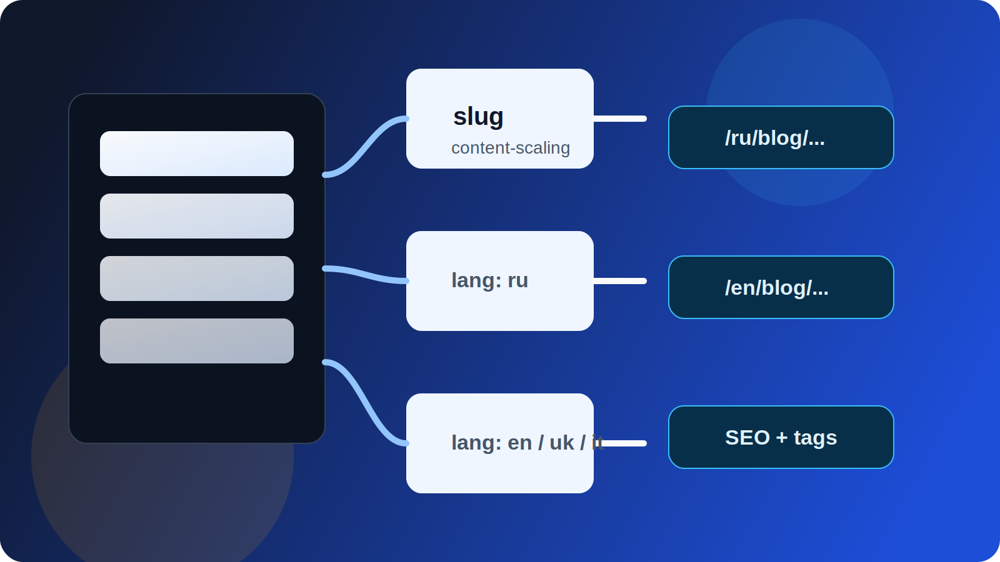
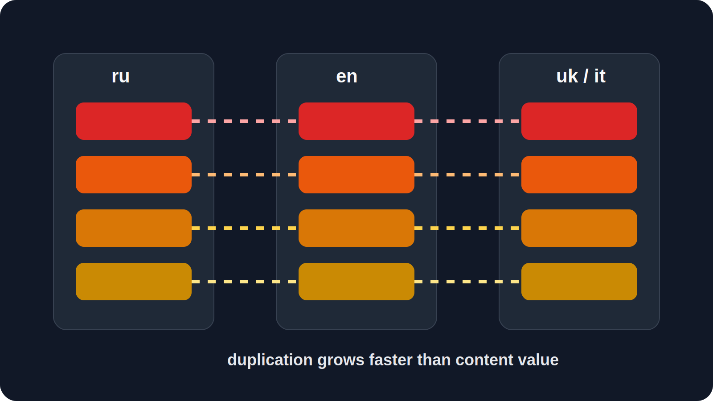
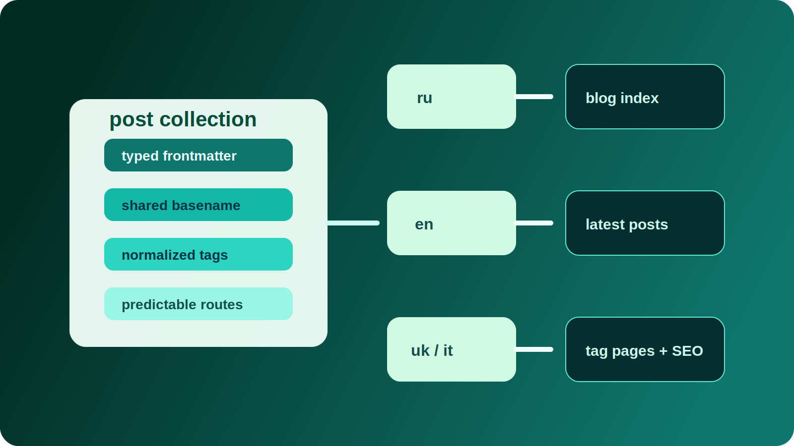

# 1. Kontext



Das Projekt ist eine mehrsprachige Plattform auf Astro-Basis mit technischem Blog, Dokumentation und Portfolio. Da der gesamte Content statisch generiert wird, beeinflusst das Inhaltsmodell nicht nur den Redaktionsprozess, sondern auch SEO, Routing, URL-Struktur und die langfristige Wartbarkeit.

Die Anforderungen an das Modell waren klar:

- Sprachtrennung ohne chaotische Duplizierung;
- eine einheitliche Routing-Logik fuer alle Sprachen;
- vorhersehbare SEO-Struktur;
- neue Sprachen ohne Refactoring des Kerns hinzufuegen zu koennen;
- gute Wartbarkeit ohne unnötige CMS-Komplexitaet.

Am Anfang war die Struktur linear. Artikel wurden einzeln angelegt und Lokalisierung wurde praktisch durch Kopieren von Dateien geloest. Solange der Umfang klein war, funktionierte das. Mit mehr Artikeln und mehr Lokalen wurden die architektonischen Grenzen sichtbar.

---

# 2. Problem



Die wichtigsten Probleme traten schnell auf:

1. Jede neue Sprache erhoehte die Anzahl der Dateien proportional.
2. Navigation und Artikellisten konnten zwischen Lokalen auseinanderlaufen.
3. Frontmatter wurde dupliziert und begann zu divergieren.
4. SEO-Felder mussten manuell kontrolliert werden.
5. Die Projektstruktur wurde mit der Zeit unvorhersehbarer.

Das Modell, jede lokalisierte Version als eigenstaendige Einheit zu behandeln, skalierte schlecht. Die eigentlichen Kosten lagen nicht im Schreiben von Content, sondern in der Pflege der Struktur.

---

# 3. Randbedingungen

Die Loesung musste reale technische Grenzen respektieren:

1. Nur statische Generierung ohne Server-Logik.
2. Klare URLs pro Sprache.
3. Moeglichst wenig manuelle Synchronisierung.
4. Neue Sprachen ohne Umschreiben der Routen.
5. Eine Umsetzung, die in normalen Engineering-Workflows beherrschbar bleibt.

Es ging also um eine Architektur, die im Alltag einfach bleibt und trotzdem stabil skaliert.

---

# 4. Gepruefte Optionen

## Option 1: Vollstaendige Verzeichnis-Duplizierung pro Sprache

```text
content/
  ru/
  en/
  uk/
  it/
  de/
  fr/
```

Vorteile:

- einfache erste Umsetzung;
- offensichtliche Sprachtrennung.

Nachteile:

- lineares Dateiwachstum;
- hohes Risiko fuer Versionsdrift;
- wiederholte Metadaten;
- manuelle Synchronisierung der Struktur.

Dieser Ansatz wurde auf Dauer zu teuer in der Pflege.

## Option 2: Eine Quelle mit Woerterbuch-Uebersetzungen

Der Content liegt in einer Datei und Texte werden ueber ein i18n-Woerterbuch uebersetzt.

Nachteile:

- schlecht fuer lange Artikel geeignet;
- geringe redaktionelle Unabhaengigkeit der Lokalen;
- schwache SEO-Anpassung fuer umfangreiche Inhalte;
- unbequemer Workflow fuer Markdown-lastige Artikel.

Fuer technische Artikel war dieses Modell zu fragil.

## Option 3: Astro Content Collections mit Sprachtrennung

Content Collections mit typisiertem Frontmatter und gemeinsamer Dateinamenskonvention.

Vorteile:

- ein gemeinsames Datenschema;
- Validierung verpflichtender Felder;
- vorhersehbare Routengenerierung;
- Gruppierung von Uebersetzungen ueber einen gemeinsamen Slug.

Das wurde zur Basisstrategie.

---

# 5. Gewaehlter Ansatz



Das finale Modell ist hybrid:

1. Alle Artikel liegen in einer `post`-Collection.
2. Die Sprache wird ueber das Locale-Verzeichnis bestimmt.
3. Derselbe Artikel verwendet in allen Sprachen denselben Dateibasisnamen.
4. Uebersetzungen werden ueber den gemeinsamen Slug verbunden.
5. Navigation und Blog-Listen werden aus der Collection generiert.

Damit bleiben Inhalte pro Sprache getrennt, waehrend Routing, Tags und SEO zentral gesteuert werden.

---

# 6. Umsetzungsdetails

## 6.1 Collection-Schema

Das `post`-Schema in `src/content/config.ts` definiert die erlaubte Frontmatter-Struktur und verhindert, dass Artikel in beliebige Metadatenformate abdriften.

## 6.2 Normalisierung von Slug und Tags

Das Projekt berechnet Slug, Permalink, Category und Tags zentral in `src/utils/blog.ts`.

Das sorgt fuer:

- einheitliche Regeln fuer alle Sprachen;
- automatisch route-sichere Tags.

## 6.3 Gruppierung der Uebersetzungen

Lokalisierte Versionen werden ueber den gemeinsamen Slug-Teil gruppiert. Dadurch koennen sprachspezifische Listen und Routen ohne manuelles Mapping aufgebaut werden.

## 6.4 Automatische Aufnahme in den Blog

Blog-Index und Latest-Posts-Widgets lesen direkt aus der Collection. Neue Artikel erscheinen dadurch automatisch in der Blog-Liste, in Tag-Seiten und in den neuesten Beitraegen.

---

# 7. Trade-offs

Das Modell hat seinen Preis:

1. Die Build-Time-Logik wird etwas komplexer.
2. Dateinamen muessen zwischen Sprachen konsistent bleiben.
3. Disziplin im Frontmatter wird verpflichtend.

Diese Komplexitaet ist aber deutlich guenstiger als dauerhafte manuelle Synchronisierung.

---

# 8. Ergebnis

Das praktische Ergebnis ist eindeutig:

1. Neue Sprachen erfordern kein Architektur-Refactoring des Blogs.
2. Die URL-Struktur bleibt vorhersehbar.
3. Tags und Kategorien werden zentral erzeugt.
4. Die Navigation bleibt automatisch synchronisiert.
5. Die Zahl der Fehlerquellen sinkt.

Skalierung haengt damit vor allem von der Anzahl der Artikel ab, nicht von staendig wiederholten Architektur-Anpassungen.

---

# 9. Schlussfolgerungen

1. Content-Skalierung ist ein Datenstruktur-Problem, nicht nur ein Mengenproblem.
2. Duplizierung zerstoert Wartbarkeit schneller als es am Anfang wirkt.
3. Typisiertes Frontmatter ist auch in Markdown-orientierten Projekten wertvoll.
4. Die Gruppierung von Uebersetzungen ueber einen gemeinsamen Slug ergibt ein stabiles Lokalisierungsmodell.
5. Statische Generierung skaliert gut, wenn die Content-Architektur bewusst entworfen ist.
