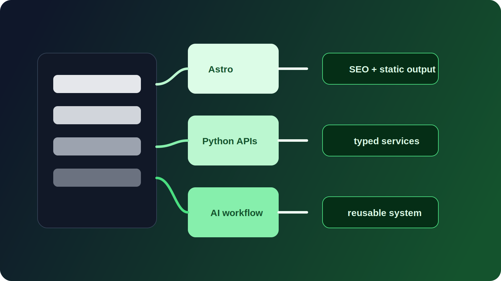

# 1. Kontext



Der eingesetzte Stack ist auf statische und hybride Websites, Dokumentationssysteme und Python-basierte Backend-Services ausgerichtet. Die zentralen Bausteine sind Astro fuer Frontend-Orchestrierung, MkDocs fuer Dokumentation, Python-Frameworks fuer APIs und AI-Werkzeuge als unterstuetzende Ebene fuer Analyse und Beschleunigung des Workflows.

Ziel des Stacks ist nicht moeglichst viel Technologie, sondern architektonische Kontrolle: vorhersehbare Skalierung, Wiederverwendung von Komponenten und eine Struktur, die auch bei wachsenden Anforderungen konsistent bleibt.

---

# 2. Problem

Viele kleine und mittlere Projekte leiden unter denselben Problemen:

- fragmentierte Code-Struktur;
- schwache Wiederverwendungsstrategie;
- fehlende systematische Mehrsprachigkeit;
- Vermischung von Content, Logik und Darstellung;
- geringe Beherrschbarkeit bei Wachstum.

Hinzu kommt die Aufgabe, AI-Werkzeuge sinnvoll zu integrieren, ohne die Architekturdisziplin aufzugeben.

---

# 3. Randbedingungen

Bei der Auswahl der Technologien wurden folgende Punkte beruecksichtigt:

1. Geringe Infrastrukturkosten.
2. Deployment auf Edge-Plattformen und statischem Hosting.
3. Moeglichst geringe Abhaengigkeit von schweren CMS-Systemen.
4. Klare Trennung von Frontend und Backend.
5. AI-Einsatz ohne Weitergabe sensibler Daten.
6. Manuelle Kontrolle der Projektstruktur statt versteckter Abstraktionen.

Der Stack muss auf Architekturebene beherrschbar sein, nicht nur auf Framework-Ebene.

---

# 4. Gepruefte Optionen

## 4.1 Vollstaendiger SPA-Ansatz

Betrachtet wurden Next.js und aehnliche Loesungen.

Vorteile:

- hohe Flexibilitaet;
- reifes Oekosystem.

Gruende fuer die Ablehnung:

- zu komplex fuer die meisten Projekte;
- hoehere Infrastrukturkosten;
- SEO-Risiken bei falscher Konfiguration.

## 4.2 CMS-Ansatz

Betrachtet wurden WordPress und vergleichbare Systeme.

Vorteile:

- schneller Start;
- viele fertige Plugins.

Gruende fuer die Ablehnung:

- schwacher Architektur-Kontrollgrad;
- begrenzte strukturelle Skalierbarkeit;
- hoeheres Risiko fuer technischen Schuldenaufbau.

## 4.3 Reines Backend plus Templates

Vorteile:

- volle Kontrolle ueber Serverlogik.

Gruende fuer die Ablehnung:

- doppelte Logik;
- schwache UI-Wiederverwendbarkeit;
- Schwierigkeiten beim Skalieren des Frontends.

---

# 5. Gewaehlter Ansatz

Gewaehlt wurde ein hybrider Architektur-Stack:

- Astro als primärer Frontend-Orchestrator;
- MkDocs fuer Dokumentation und strukturierte Inhalte;
- Python mit Django Ninja, FastAPI und Flask fuer APIs und Serverlogik;
- AI-Werkzeuge als unterstuetzende Engineering-Ebene.

Die Kernidee ist die Trennung der Verantwortlichkeiten.

| Ebene | Werkzeug | Rolle |
| --- | --- | --- |
| UI und Content | Astro | Statische Generierung, SEO, Seitengestaltung |
| Dokumentation | MkDocs | Strukturierter Content und Navigation |
| API | Django Ninja / FastAPI | Leichtgewichtiges typisiertes Backend |
| Leichte Services | Flask | Isolierte Mikroservices und Prototypen |
| AI | Gemini / Copilot / ChatGPT | Analyse, Entwuerfe und Review-Unterstuetzung |

---

# 6. Umsetzungsdetails

## 6.1 Frontend mit Astro

Die Basisstruktur sieht so aus:

```text
src/
  components/
  layouts/
  pages/
  libs/
  i18n/
public/
```

Wichtige Prinzipien:

- Komponenten haengen nicht von einzelnen Seiten ab;
- Mehrsprachigkeit wird ueber Ordnerstruktur und Woerterbuecher umgesetzt;
- wiederverwendbare Bloecke werden in `libs/` ausgelagert.

## 6.2 Mehrsprachigkeitsstrategie

Der Stack nutzt:

- strukturelle Sprachtrennung (`/en/`, `/ru/`, `/uk/`, `/it/`, `/de/`, `/fr/`);
- zentrale Woerterbuecher;
- explizites Routing;
- SEO-orientierte URL-Struktur.

Sprache wird als Teil der Architektur verstanden, nicht als spaeterer Zusatz.

## 6.3 Python-Backend

### Django Ninja / FastAPI

Einsatz fuer:

- JSON-APIs;
- administrative Services;
- Datenbankintegration.

Die Wahl basiert auf:

- Performance;
- Typisierung;
- vorhersehbarer Projektstruktur.

### Flask

Einsatz fuer:

- leichte Services;
- Prototyping;
- isolierte Mikroservices.

## 6.4 AI im Workflow

AI wird als Qualitaetsverstaerker betrachtet, nicht als Quelle der Architektur.

Sie hilft bei:

- Entwurfs- und Scaffold-Generierung;
- architektonischer Analyse;
- technischer Textverbesserung.

AI definiert nicht die Projektstruktur. Sie beschleunigt Umsetzung und Validierung.

## 6.5 Wiederverwendung von Komponenten

Komponenten werden so entworfen, dass sie:

- unabhaengig sind;
- nicht an ein einzelnes Projekt gebunden sind;
- stilistisch isoliert bleiben;
- in eigene Bibliotheken ueberfuehrt werden koennen.

---

# 7. Trade-offs

## 7.1 Astro gegen SPA

Vorteile:

- hohe Performance;
- direkter HTML-Kontrollgrad;
- SEO-freundliche Ausgabe.

Nachteile:

- weniger eingebaute Interaktivitaet.

Loesung: Islands-Architektur nur dort einsetzen, wo echte Interaktivitaet benoetigt wird.

## 7.2 Mehrsprachigkeit ueber Ordnerstruktur

Vorteile:

- klare Struktur;
- SEO-Transparenz.

Nachteile:

- mehr Dateien;
- hoeherer Pflegeaufwand.

## 7.3 Trennung von Backend und Frontend

Vorteile:

- unabhaengige Weiterentwicklung;
- bessere Skalierbarkeit.

Nachteile:

- zusaetzliche API-Koordination.

## 7.4 AI-Integration

Vorteile:

- schnellere Entwicklung;
- bessere Entwuerfe und Formulierungen.

Nachteile:

- Risiko oberflaechlicher Loesungen;
- kontinuierlicher Bedarf an Engineering-Review.

---

# 8. Ergebnis

Der entstandene Stack:

- ermoeglicht schnelle Projektstarts;
- bleibt vorhersehbar in der Wartung;
- skaliert von Landingpages bis zu komplexeren Strukturen;
- bleibt architektonisch kontrollierbar;
- unterstuetzt Wiederverwendung;
- funktioniert gut mit modernen AI-gestuetzten Workflows.

---

# 9. Schlussfolgerungen

1. Ein Technologie-Stack sollte nach architektonischer Passung gewaehlt werden, nicht nach Trendwert.
2. Wartbarkeit ist wichtiger als reine Breite des Oekosystems.
3. Mehrsprachigkeit, SEO und Wiederverwendung muessen von Anfang an strukturell mitgedacht werden.
4. AI verbessert den Prozess nur dort, wo bereits Architekturdisziplin besteht.
5. Ein starker Stack senkt die Kosten spaeterer Aenderungen und laesst Projekte ohne chaotische Komplexitaet wachsen.
