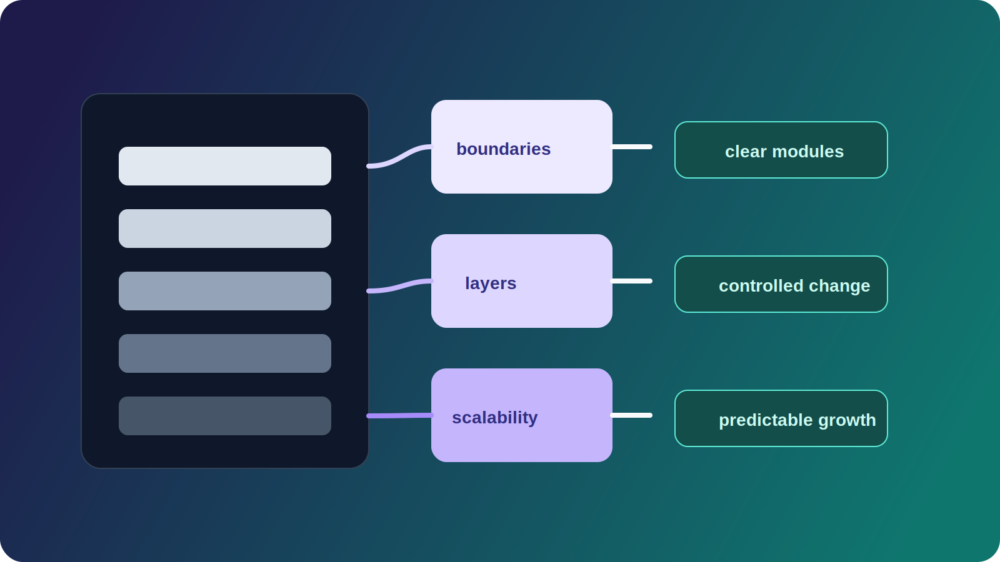

# 1. Контекст



В большинстве проектов архитектура упоминается как абстрактное понятие. Часто под ней понимают выбор фреймворка, способ деплоя или диаграмму компонентов. В реальности архитектура представляет собой совокупность структурных решений, которые определяют поведение системы в долгосрочной перспективе.

Для работодателя и команды архитектура имеет прикладное значение: она влияет на стоимость изменений, скорость разработки, устойчивость к росту нагрузки и возможность масштабирования команды. Архитектура — это не описание технологий, а модель управления сложностью.

---

# 2. Проблема

Большинство проектов начинают без явных архитектурных границ. На раннем этапе это ускоряет разработку, но при росте функциональности появляются системные проблемы:

- логика распределена хаотично;
- зависимости становятся неконтролируемыми;
- изменение одной части системы влияет на другие;
- повторное использование затрудняется;
- внедрение новых разработчиков замедляется.

Отсутствие архитектуры редко заметно сразу. Она становится критичной в тот момент, когда система начинает масштабироваться.

---

# 3. Ограничения

При проектировании архитектуры необходимо учитывать реальные ограничения:

- бюджет и сроки;
- размер команды;
- требования к SEO;
- производительность;
- необходимость мультиязычности;
- интеграции с внешними сервисами;
- требования к деплою и инфраструктуре.

Архитектура не существует в изоляции. Она обязана соответствовать масштабу задачи и контексту проекта.

---

# 4. Рассмотренные варианты

## Вариант 1: Минимальная структура без явных границ

Преимущества:

- быстрый старт;
- минимум абстракций.

Недостатки:

- рост технического долга;
- сложности при масштабировании;
- отсутствие изоляции слоёв.

## Вариант 2: Избыточная абстракция

Рассматривались сложные паттерны и преждевременное дробление на микросервисы.

Преимущества:

- формальная структурированность.

Недостатки:

- высокая стоимость поддержки;
- сложность онбординга;
- неоправданная инфраструктурная нагрузка.

## Вариант 3: Сбалансированная слоистая архитектура с чёткими границами

Преимущества:

- управляемые зависимости;
- переносимость компонентов;
- предсказуемость изменений;
- масштабируемость.

Недостатки:

- необходимость дисциплины;
- дополнительные проектные решения на старте.

Выбран третий вариант.

---

# 5. Выбранный подход

Архитектура строится вокруг следующих принципов:

1. Разделение ответственности.
2. Явные границы зависимостей.
3. Изоляция инфраструктуры.
4. Возможность масштабирования без полной переработки.
5. Предсказуемая структура проекта.

Упрощённая структура:

```text
src/
  features/
  components/
  services/
  shared/
  infrastructure/
```

- `features` содержат функциональные модули;
- `components` отвечают за UI;
- `services` содержат бизнес-логику;
- `shared` объединяет переиспользуемые утилиты;
- `infrastructure` изолирует адаптеры к внешним системам.

Инфраструктура не должна проникать в бизнес-логику напрямую.

---

# 6. Детали реализации

## 6.1 Границы зависимостей

Принцип направленных зависимостей выглядит так:

- UI зависит от бизнес-логики;
- бизнес-логика не зависит от UI;
- инфраструктура подключается через интерфейсы.

Это позволяет:

- заменить источник данных;
- изменить способ хранения;
- адаптировать систему под другой frontend или backend.

## 6.2 Масштабируемость

Архитектура должна учитывать:

- горизонтальное масштабирование;
- возможность выделения сервисов при росте;
- независимость модулей.

Если рост нагрузки требует перестройки всей структуры, архитектура не соответствует задаче.

## 6.3 Мультиязычность

Структура должна заранее предусматривать расширение контента по локалям:

```text
content/
  en/
  ru/
  uk/
  it/
```

Логика локализации при этом изолируется от бизнес-логики. Это позволяет расширять языки без изменения ядра системы.

## 6.4 Повторное использование

Компоненты проектируются так, чтобы:

- не зависеть от конкретного проекта;
- иметь минимальные внешние зависимости;
- переноситься в отдельные библиотеки.

Повторное использование является следствием архитектуры, а не отдельной задачей после разработки.

## 6.5 Интеграция AI

Структурированная архитектура упрощает:

- генерацию кода по шаблону;
- автоматический рефакторинг;
- контроль соответствия проектной структуре.

AI-инструменты усиливают команду только там, где уже существует формализованная архитектурная модель.

---

# 7. Компромиссы

Каждое решение имеет последствия:

- жёсткие границы замедляют первоначальную разработку;
- изоляция слоёв увеличивает количество файлов;
- дополнительная структура требует инженерной дисциплины.

Однако отказ от этих решений значительно повышает стоимость изменений в будущем. Архитектура всегда является выбором между скоростью старта и устойчивостью роста.

---

# 8. Результат

При использовании выбранного подхода достигается:

- предсказуемость изменений;
- снижение технического долга;
- упрощённый онбординг новых разработчиков;
- управляемая масштабируемость;
- прозрачная структура проекта.

Система остаётся расширяемой без полной переработки базовых решений.

---

# 9. Выводы

1. Архитектура — это не технология, а стратегия организации системы.
2. Отсутствие архитектурных границ приводит к неконтролируемому росту сложности.
3. Избыточная архитектура так же вредна, как и её отсутствие.
4. Масштабируемость закладывается на этапе структуры, а не после появления проблем.
5. Документированные решения снижают зависимость проекта от конкретного разработчика.

Архитектура для понимания — это способ организовать систему так, чтобы её поведение оставалось предсказуемым при росте сложности.
